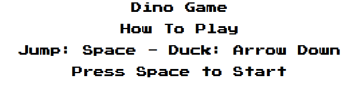

# Dino Game

> Uma versão simplificada do jogo 'Dino' do navegador Chrome usando JavaScript.

*Read it in other languages:* [English](https://github.com/filimor/dino-game/blob/master/README.md) :us:,
[Português (Brasil)](https://github.com/filimor/dino-game/blob/master/README.pt-BR.md) :brazil:

## Descrição

O jogo consiste em um remake bastante simplificado do jogo Dino do Google
Chrome, que podia ser jogado quando o navegador estava offline. Foi criado como
um desafio para um bootcamp da DIO (Digital Innovation One). Eu usei apenas
HTML, CSS e JavaScript, sem nenhuma biblioteca, seguindo o tutorial do Brian
Koponen 'JavaScript Game Tutorial' e as diretrizes originais do dino game do
Celso Henrique, pegando também inspiração na versão jogável online T-Rex
Chrome Dinosaur Game. Eu tentei adaptar o código para a sintaxe do ES6.

Ainda há muito a fazer: terminar a implementação do cenário, corrigir a posição
dos sprites, animações e intervalos de spawn, adicionar mais cactus, melhorar
a física de pulo e limpar o código. Mas já foi o suficiente para aprender muito!

## Feito Com

- [Visual Studio Code](https://code.visualstudio.com/)
- [Firefox Developer Edition](https://www.mozilla.org/pt-BR/firefox/developer/)
- [Piskel Sprite Editor](https://www.piskelapp.com/)

## Traduções

- [English](https://github.com/filimor/dino-game/blob/master/README.md)
- [Português (Brasil)](https://github.com/filimor/dino-game/blob/master/README.pt-br.md)

## Créditos

- [Celso Henrique](https://github.com/celso-henrique/dio-dino-game)
- [Brian Koponen's JavaScript Game Tutorial](https://www.briankoponen.com/html5-javascript-game-tutorial-space-invaders-part-5/)
- [T-Rex Chrome Dinosaur Game](https://chromedino.com/)

## Licença

This project is licensed under the MIT License - see the
[LICENSE.md](https://github.com/filimor/dino-game/blob/master/LICENSE "MIT") file for details.
